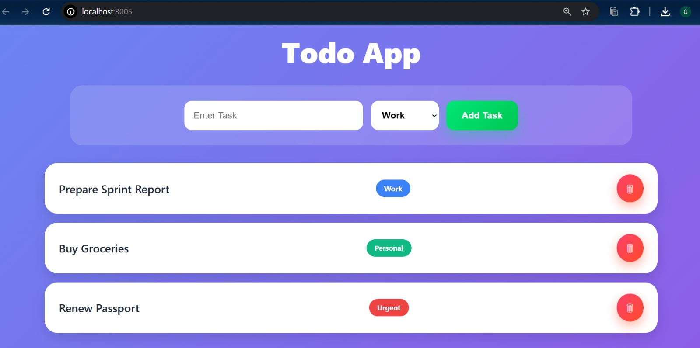

#  MergerWare Meteor Blaze Assignment

## Overview

This project is a Todo Application developed using **Meteor.js** and **Blaze Templates** as part of the **MergerWare Software Engineering Intern Technical Assessment**.

The application enables users to create, manage, categorize, and reorder tasks through an intuitive and user-friendly interface.

---
## Assessment Output


##  Features

* Add new tasks
* Delete existing tasks
* Categorize tasks into:

  * Work
  * Personal
  * Urgent
* Drag-and-drop task reordering using SortableJS
* Modern and responsive user interface

---

##  Tech Stack

* Meteor.js
* Blaze Templates
* JavaScript (ES6)
* HTML5
* CSS3
* SortableJS

---

##  Project Structure

```text
client/
├── main.html
├── main.js
└── main.css

server/
└── main.js
```

---

##  Installation & Setup

### Clone the Repository

```bash
git clone https://github.com/gangothri1612/mergerware-blaze-assignment.git
```

### Navigate to the Project Folder

```bash
cd mergerware-blaze-assignment
```

### Install Dependencies

```bash
meteor npm install
```

### Run the Application

```bash
meteor
```

### Open in Browser

```text
http://localhost:3005
```

---

##  Assignment Requirements Covered

✅ Task Categories (Work, Personal, Urgent)

✅ Drag-and-Drop Reordering

✅ Meteor.js Framework

✅ Blaze Templates

✅ JavaScript-Based Implementation

✅ Responsive and Interactive UI

---

##  Author

**K C Gangothri**

📧 Email: [gangothri1612@gmail.com](mailto:gangothri1612@gmail.com)

 VIT Chennai

---

Thank you for reviewing my submission.
